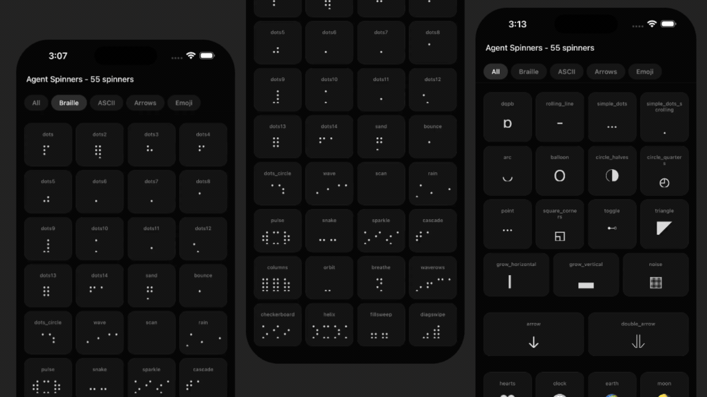

# Lynx Agent Spinners

> Originally an Expo / React Native library of 55 terminal-style agent spinners. Now also a **LynxJS** port — same 55 spinners, same animation logic, same frame arrays, running natively on iOS / Android / Web via [ReactLynx](https://lynxjs.org/next/react/introduction.md).
>
> **87% of the library code is shared** between the React Native and Lynx builds. Only the ~90-line renderer is forked. This repo is also a worked example of what we're calling a **"slopfork"**: porting a JS UI library to a new runtime by sharing maximally and forking only at the rendering boundary.

[]() []() []() []()

🎬 **Live landing page: [huangxuan.me/lynx-agent-spinners/](http://huangxuan.me/lynx-agent-spinners/)** &nbsp;·&nbsp; 📱 **Full Lynx catalog: [/lynx-app/](http://huangxuan.me/lynx-agent-spinners/lynx-app/)** &nbsp;·&nbsp; 🎤 **Hackathon deck: [/deck/](http://huangxuan.me/lynx-agent-spinners/deck/)**



---

## What this repo is

| Path | What it is | Shared? |
| --- | --- | --- |
| `src/data/` | 55 pure-TS spinner definitions (`name`, `frames`, `interval`, `category`) | ✅ shared by both runtimes |
| `src/hooks/useSpinnerFrame.ts` | The animation hook (imports `'react'`) | ✅ shared via build-time alias |
| `src/components/spinners/` | React Native renderer + 55 named exports | RN-only |
| `src/lynx/` | Lynx renderer + 55 named exports | Lynx-only |
| `App.tsx` | Expo demo app | RN-only |
| `apps/lynx/` | Full 55-spinner catalog app (ReactLynx + Rspeedy) | Lynx-only |
| `apps/screens/` | Three "signature" agent screens (chat / tools / tasks) | Lynx-only |
| `presentation/` | Landing page, deck, and Lynx-for-Web embeds — what ships to Pages | — |
| `docs/LYNX_PORT.md` | Architecture: layers, decision log, risks, implementation order | — |

The full architecture (and *why* every line is shared or forked) is documented in [`docs/LYNX_PORT.md`](./docs/LYNX_PORT.md) — read that for the engineering story.

---

## Quick start — try it locally

```bash
pnpm install
```

There are three things you can run.

### 1 · Expo demo (the original)

The React Native demo app, runs on iOS / Android / Web via Expo.

```bash
pnpm expo:ios       # iOS simulator
pnpm expo:android   # Android emulator
pnpm expo:web       # browser
```

`pnpm expo:web` requires `react-dom` and `react-native-web`; install them on demand with `pnpm dlx expo install react-dom react-native-web` if Expo prompts.

### 2 · Lynx demo (the port)

```bash
pnpm lynx:dev       # rspeedy dev server with QR code for LynxExplorer
pnpm lynx:build     # build main.lynx.bundle + main.web.bundle
pnpm lynx:preview   # static preview of the built bundle
```

`pnpm lynx:dev` prints a QR code — scan it with [LynxExplorer](https://lynxjs.org/next/guide/start/quick-start.md) on a device or emulator to see the demo. The build emits **two** artifacts:

- `apps/lynx/dist/main.lynx.bundle` — for native Lynx runtimes (iOS / Android / HarmonyOS)
- `apps/lynx/dist/main.web.bundle` — for Lynx-for-Web (loadable in any browser)

### 3 · Landing page (with live `<lynx-view>` embeds)

```bash
pnpm preso          # builds both Lynx bundles + serves on http://localhost:8090
```

The landing page at `presentation/index.html` is what ships to GitHub Pages. It embeds three signature agent screens (chat / tools / background tasks) and the full 55-spinner catalogue — every embed is a real ReactLynx app running via `<lynx-view url="...">`.

- `/` — landing page
- `/lynx-app/` — full 55-spinner catalog as a standalone Lynx app
- `/deck/` — the hackathon deck (architecture, code-reuse math, harness techniques)

> **Note** — Lynx for Web uses `SharedArrayBuffer`, which requires the page to be cross-origin isolated (`COOP: same-origin` + `COEP: require-corp`). `pnpm preso` runs a small Python server (`presentation/serve.py`) that sets those headers. On GitHub Pages, a service-worker shim (`presentation/lynx-app/coi-serviceworker.js`) installs the headers on the fly.

---

## Architecture at a glance

```
┌─────────────────────────────────────────────────────────────┐
│  LAYER 1 — Spinner data (src/data/)                         │
│  55 pure-TS files. { name, frames, interval, category }     │
│  Zero React. Zero platform imports. 100% shared.            │
└─────────────────────────────────────────────────────────────┘
                            │
                            ▼
┌─────────────────────────────────────────────────────────────┐
│  LAYER 2 — Animation hook (src/hooks/useSpinnerFrame.ts)    │
│  10 lines. Imports from 'react'.                            │
│  Rspeedy aliases 'react' → '@lynx-js/react' in Lynx build.  │
│  One file, two runtimes.                                    │
└─────────────────────────────────────────────────────────────┘
                            │
                  ┌─────────┴──────────┐
                  ▼                    ▼
   ┌──────────────────────┐  ┌──────────────────────┐
   │ LAYER 3a — RN        │  │ LAYER 3b — Lynx      │
   │ src/components/      │  │ src/lynx/Spinner.tsx │
   │   spinners/          │  │ + index.tsx          │
   │ <View>/<Text>,       │  │ <view>/<text>,       │
   │ numeric styles       │  │ CSS-string styles    │
   └──────────────────────┘  └──────────────────────┘
```

**The fork is intentional** — `<View>` vs `<view>`, numeric styles vs CSS strings, `style={[...]}` arrays vs flat `className`. These aren't bridgeable via aliasing. They require different JSX *and* different style value formats. So we fork — but only there.

[Full architecture doc with decision log →](./docs/LYNX_PORT.md)

---

## Library usage

Both renderers expose the same 55 named exports.

```tsx
// React Native
import { DotsSpinner, MoonSpinner } from "lynx-agent-spinners";
<DotsSpinner size={24} color="#fff" />

// Lynx
import { DotsSpinner, MoonSpinner } from "lynx-agent-spinners/lynx";
<DotsSpinner size={24} color="#fff" />
```

The 55 spinners cover **4 categories**:

| Category | Count | Examples |
| --- | --- | --- |
| Braille | 32 | `dots`, `dots2…14`, `wave`, `sand`, `helix`, `cascade` |
| ASCII | 15 | `arc`, `simple_dots`, `dqpb`, `triangle`, `noise` |
| Arrows | 2 | `arrow`, `double_arrow` |
| Emoji | 6 | `moon`, `earth`, `clock`, `weather`, `hearts`, `speaker` |

Full props/API in the [original library README excerpt below](#props).

---

## The slopfork playbook

This repo is a worked example of porting a JS UI library to a new runtime with minimal divergence. The seven steps:

1. **Architecture doc first.** Write the layered map + decision log + numbered implementation order *before* touching code.
2. **Find the fork line.** Cluster everything platform-agnostic (data, types, pure hooks). Push it into one shared tree. Only fork at the JSX + style-value boundary.
3. **One build-time alias replaces one platform shim.** `'react' → '@lynx-js/react'` unlocks the shared hook. Prefer aliasing over abstracting.
4. **One commit per user story, always end with a runnable artifact.** Bundle size, screenshot, byte-identity check — never "tests pass."
5. **Subagents for platform docs.** Dispatch Explore + the platform's MCP (here: `lynx-docs`) for element reference, instead of web-searching.
6. **Verify visually, every step.** Bracket every "feature complete" claim with a screenshot or recording of the running demo. Compile is not done.
7. **Run the agent in a Ralph loop with a goal hook.** One US per turn, harness blocks stop until the goal is met. Walk away, come back to a finished port.

Full breakdown in the [hackathon deck](./presentation/index.html).

---

## Props

All spinners share the same interface:

| Prop | Type (RN) | Type (Lynx) | Default | Description |
|------|------|------|---------|-------------|
| `size` | `number` | `number` | `24` | Font size of the spinner character |
| `color` | `string` | `string` | `"#fff"` | Color of the spinner |
| `style` | `StyleProp<ViewStyle>` | — | — | Outer container style (RN) |
| `className` | — | `string` | — | Outer container class (Lynx) |

### Container sizing

Spinners render Unicode characters whose pixel width depends on font rendering. Wrap in a fixed-size container to prevent layout drift:

```tsx
<View style={{ width: 40, height: 40, alignItems: "center", justifyContent: "center" }}>
  <DotsSpinner size={24} color="#fff" />
</View>
```

| Spinner type | Characters | Recommended `width` |
|---|---|---|
| Single char (`dots`, `moon`, `arc`…) | 1 | `40` |
| Two chars (`dots12`, `wave`, `scan`…) | 2 | `64` |
| Three+ chars (`point`, `columns`…) | 3–4 | `80–96` |

---

## Why text-based spinners?

- **AI agent streams** — show activity while waiting for LLM responses
- **CLI-style UIs** — give your app a developer aesthetic
- **Lightweight loading states** — no SVG, no Lottie, no heavy assets
- **Monospace layouts** — pair with code editors or terminal screens

---

## Credits

- Original Expo / React Native library by [@eronred](https://github.com/eronred).
- Lynx port + presentation by [@huxpro](https://github.com/huxpro).
- Frame inspiration from [vyfor/rattles](https://github.com/vyfor/rattles).
- [Lynx](https://lynxjs.org), [Rspeedy](https://lynxjs.org/next/rspeedy/), and [ReactLynx](https://lynxjs.org/next/react/introduction.md) by the Lynx team.

## License

MIT
